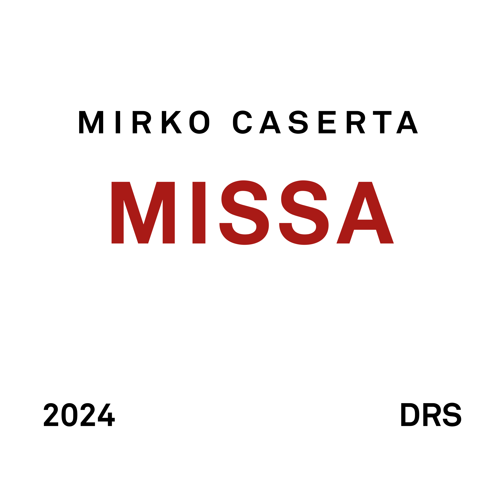

## Long Story Short

Questo è un album di musica improvvisata. Il suono è quello dell'organo di Hans
Zimmer in Interstellar. L'ispirazione è chiaramente ecclesiastica. Ho provato a
immaginare delle melodie sui titoli dei brani e a svilupparle scimmiottando
(male) lo stile contrappuntistico.

## Short Story Long

Il mio primo incarico da musicista è arrivato piuttosto presto. Credo fossi in
prima media quando il mio insegnante di pianoforte mi propose di prendere il suo
posto come organista nella chiesa del paese.

Non avevo mai studiato bene il solfeggio, la mia capacità di lettura era davvero
rudimentale e questo mi rendeva nervoso ma la musica di chiesa non richiede
grandi capacità esecutive: basta un po' d'orecchio per gli accordi e ci si può
facilmente districare nella maggiorparte dei canti.

Il mio compito era quello di accompagnare il coro durante la funzione della
domenica mattina. A volte facevo delle prove pomeridiane con il coro durante la
settimana ma questa abitudine ebbe vita breve per via della predisposizione
degli adolescenti a dedicarsi ad attività come zuffe e goffi tentativi di
riproduzione sessuale.

La mia attività da organista non durò molto. Una volta, durante le cresime, ebbi
la brillante idea di usare il sintetizzatore per suonare alcune melodie e questa
cosa non piacque per nulla al vescovo. Il parroco mi spiegò che in chiesa erano
ammessi solo strumenti acustici e l'organo. Potevo mai tollerare che si mettesse
bocca sulle mie scelte artistiche? Fu così che la mia collaborazione con la
parrocchia ebbe bruscamente fine.

Ricordo anche che una volta spaccai il muso ad un ragazzo del coro perché ebbe
l'ardire di commentare in modo inappropriato gli LP che quel giorno portavo con
me: Invitation di Jaco Pastorius, 8:30 dei Weather Report e qualcosa di Larry
Carlton se non ricordo male. Poi gli chiesi scusa e mi feci prestare i suoi CD
di [Fronte del Palco](https://it.wikipedia.org/wiki/Fronte_del_palco) per
tentare una riappacificazione musicale totalmente finta da parte mia.

Ad ogni modo, per almeno due o tre anni ho partecipato attivamente all'attività
musicale della comunità della parrocchia. Conoscevo i brani più popolari e
sapevo quando inserirli nelle varie sezioni delle funzioni religiose. Sono stato
un discreto ragazzo di chiesa ma ho sempre visto con distacco i tanti aspetti
della pratica cristiana che fanno visibilmente a cazzotti con la realtà e il mio
approccio scettico e razionale alle cose della vita.

Già a quei tempi si era fatta strada in me l'idea che non esiste un dio e che le
tante cose insensate delle religioni sono tali non perché io non sia in grado di
comprenderle o per mancanza di fede ma semplicemente perché sono e restano
insensate e contrarie alla logica e alla ragione a disposizione di qualunque
persona minimamente istruita.

Tutto questo per dire che in qualche modo questa musica per me è un ritorno alle
origini. Mi sono divertito a tornare sulla panca dell'organo, seppure
virtuale[^hz].

L'album esce su tutte le piattaforme digitali venerdì 20 settembre 2024 alle
cinque del pomeriggio:

- [spotify](https://open.spotify.com/album/7KICYco2gWoVWM0a4VNfGL)
- [apple music](https://music.apple.com/it/album/missa/1769017135)
- [youtube](https://www.youtube.com/playlist?list=OLAK5uy_lBHhMleVJdxWUTJsFS5boYUHfBVrBeIzo)
- [deezer](https://www.deezer.com/it/album/643728081)

[^hz]:
    lo strumento è
    [The Legend HZ](https://www.synapse-audio.com/thelegendhz.html) e il preset
    si chiama _Interstellar_
