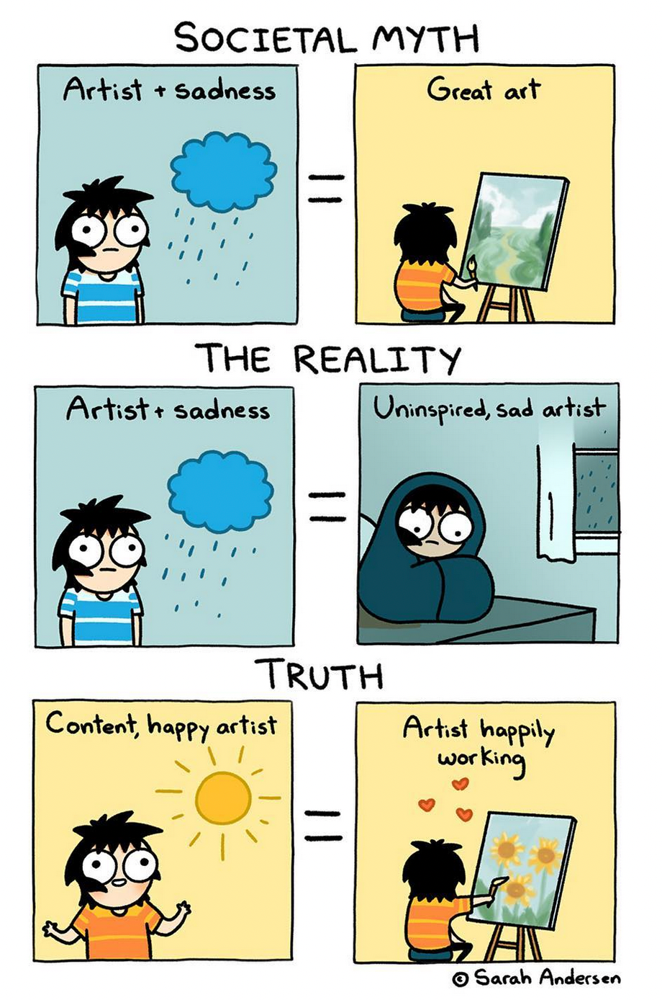

> «Everything I’ve ever let go of has claw marks on it.» — David Foster Wallace

The nice thing with instrumental music is that giving titles to songs is maybe
trivial and can sometimes be lots of fun.

I had this album's title written down in a list of possible song names that I
keep in my notebook. I wasn't really thinking about it until I started seeing
the album cover showing up online after I pushed the _publish_ button.

And then it hit me:

«The Last Time I Had Fun (It Was A Long Time Ago)»

When was the last time I had fun? What does it mean to have fun? What the hell
is fun?

I make no secret of my life long struggle with depression, anxiety, panic
attacks and agoraphobia. I used to be shy about it and keep it to myself as
people see it as a weakness. It isn't. Of course it is not.

When I had my first panic attack I was just in my twenties and it scared me
shitless. I had no idea what was happening to me. I was living in a relatively
small town and I had maybe heard the word _depression_ a few times, always
referring to someone no one would dare go near to.

[credits](https://www.instagram.com/p/CjiZuPOsOr4/)

These days things are a bit better. Mental illness still carries around a stigma
but more and more people are aware of what it means to be depressed, to
experience debilitating anxiety and so on.

I am still scared shitless of my condition but I've somewhat learned to live
with it. I spend most of my days working at home so I don't get easily
triggered, except for family or job matters. It's manageable though.

But yeah, I can't remember when it was the last time I've had fun. I've had
some. The most fun I have these days is playing music for myself at home. So, in
a sense, this is me trying to share some of my fun, knowing that not everyone
has fun the same way and most won't like my music, but some will, and it is for
those that I do this.

You can listen to The Last Time I Had Fun for free by clicking
[this link](https://album.link/thelasttimeihadfun).
