---
title:
  "Un'Introduzione alla Rappresentazione, Serializzazione e Gestione del Tempo
  nel Software"
date: 2013-04-15T14:19:00Z
toc: true
tags:
  - time
  - software development
pdf: true
---

La maggior parte dei problemi nello sviluppo software solitamente nascono da una
conoscenza scarsa e inconsistente del dominio in questione. Un argomento
apparentemente semplice come la rappresentazione, serializzazione e gestione del
tempo può facilmente causare una serie di problemi sia al programmatore neofita
che a quello esperto.

In questo post, vedremo che non c'è bisogno di essere un
[Signore del Tempo](http://en.wikipedia.org/wiki/Time_Lord) per afferrare i
pochissimi concetti semplici necessari per non incappare nell'inferno della
gestione del tempo.

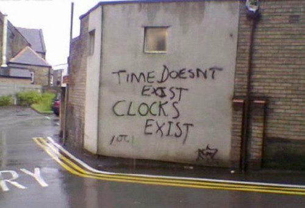

## Rappresentazione

Una domanda semplice come _"Che ore sono?"_ presuppone una serie di sfumature
contestuali che sono ovvie per il cervello umano, ma diventano assolutamente
prive di senso per un computer.

Per esempio, se mi stessi chiedendo che ore sono proprio ora, potrei dire:
_"Sono le 15:39"_ e, se fossi un collega nel mio ufficio, questa sarebbe
un'informazione sufficiente per dedurre che sono le 15:39 CEST. Questo perché
saresti già in possesso di alcuni bit di informazioni contestuali importanti
come

- è pomeriggio perché abbiamo già pranzato
- siamo a Roma, quindi il nostro fuso orario è l'Ora dell'Europa Centrale (CET)
  o l'Ora Estiva dell'Europa Centrale (CEST)
- siamo passati all'ora legale alcune settimane fa, quindi il fuso orario
  corrente deve essere l'Ora Estiva dell'Europa Centrale

_15:39_ è una rappresentazione conveniente del tempo finché siamo in possesso
dei bit contestuali. Per rappresentare il tempo in modo universale, dovreste
avere un'idea di cosa siano
[UTC](http://en.wikipedia.org/wiki/Coordinated_Universal_Time) e i
[fusi orari](http://en.wikipedia.org/wiki/Time_zone).

Vi prego di non confondere UTC con GMT: anche se il loro orario coincide, sono
_due cose diverse_: uno è uno standard universale mentre l'altro è un fuso
orario. Quando qualcuno dice di usare GMT, a meno che quella persona non abbia
un divertente accento scozzese, quello che intende veramente è UTC.

Come radioamatore, ho contatti con persone da tutto il mondo. Ogni operatore è
tenuto a mantenere un registro dei suoi contatti, e di solito ci scambiamo le
cosiddette cartoline QSL, che sono una conferma scritta del contatto. Ovviamente
una cartolina QSL deve riportare l'orario esatto del contatto radio e per
convenzione è in UTC. So che quando ricevo una cartolina QSL da qualsiasi
collega radioamatore, non importa dove sia localizzato in tutto il mondo, posso
consultare il contatto nel mio registro e le informazioni di data e ora
corrisponderanno, dato che stiamo entrambi aderendo allo stesso standard: UTC.

Ora, supponiamo di dover programmare una chat Skype con un collega sviluppatore
negli Stati Uniti. Potrei scrivergli una email e dire qualcosa come _"ci vediamo
il 2/3"_. In Italia, questo sarebbe il secondo giorno del mese di marzo, ma per
una persona statunitense, questo sarebbe il terzo giorno del mese di febbraio.
Come potete vedere, la nostra chat non avverrà mai.

Questi sono solo alcuni esempi del tipo di problemi che potrebbero sorgere
quando si rappresentano informazioni di data e ora. Fortunatamente, c'è una
soluzione agli enigmi della rappresentazione, ovvero lo standard
[ISO 8601](http://en.wikipedia.org/wiki/ISO_8601) o, meglio ancora,
[RFC 3339](https://www.rfc-editor.org/rfc/rfc3339).

Solo per darvi un esempio, in RFC 3339, `1994-11-05T08:15:30-05:00` corrisponde
al 5 novembre 1994, 8:15:30 am, Ora Standard dell'Est degli Stati Uniti.
`1994-11-05T13:15:30Z` corrisponde allo stesso istante (la `Z` sta per UTC).
Stesso istante, rappresentazioni diverse.

RFC 3339 ha anche il bel effetto collaterale di fornire ordinamento naturale in
sistemi che utilizzano l'ordine lessicografico (come i filesystem) perché
l'informazione è organizzata dalla più alla meno significativa, ovvero anno,
mese, giorno, ora, minuto, secondo, frazione di secondo[^tz].

Anche se state gestendo solo orari locali nel vostro software, dovreste sapere
che, a meno che non visualizziate anche il fuso orario, non potete mai essere
sicuri dell'orario. Non riesco a ricordare quante volte uno sviluppatore mi ha
chiesto di _sistemare l'orario_ sul server, solo per scoprire che il suo
software stava stampando l'orario in UTC.

Al momento della visualizzazione, è normale gestire rappresentazioni parziali
del tempo perché l'esperienza utente lo richiede. Assicuratevi solo, durante il
debugging, di stampare l'intero set di informazioni, incluso il fuso orario,
altrimenti non potrete mai essere sicuri che quello che state guardando sia
quello che pensate veramente che sia.

Anche se un dato momento nel tempo è immutabile, c'è un numero arbitrario di
modi per esprimerlo. E non abbiamo nemmeno parlato dei calendari giuliano o
indiano o di cose come esprimere le durate!

Lasciatemi riassumere alcuni punti chiave da portare a casa finora:

- imparate a conoscere i [fusi orari](http://en.wikipedia.org/wiki/Time_zone) e
  [UTC](http://en.wikipedia.org/wiki/Coordinated_Universal_Time)
- non confondete UTC e GMT
- [RFC 3339](https://www.rfc-editor.org/rfc/rfc3339) e
  [ISO 8601](http://en.wikipedia.org/wiki/ISO_8601) sono vostri amici
- stampate sempre il fuso orario durante il debugging

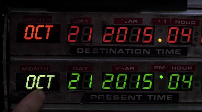

## Serializzazione

Parlando di software, la serializzazione è un processo dove prendete lo stato di
un oggetto e lo specifica in modo tale che possa essere successivamente
interamente ricostruito, esattamente come l'originale, utilizzando le
informazioni esplicitate (serializzate). Pensate a un file xml o json:

```json
{
  "person": {
    "name": "Mirko",
    "surname": "Caserta",
    "class": "nerd"
  }
}
```

Questa è la forma serializzata di una particolare istanza immaginaria della
classe persona.

Nel mondo binario dei computer, il tempo è solitamente serializzato e
memorizzato utilizzando la convenzione del
[tempo Unix](http://en.wikipedia.org/wiki/Unix_time). Mentre sto scrivendo
questo, il mio tempo Unix è `1366191727`. Ovvero: `1366191727` secondi sono
passati dal 1° gennaio 1970 alle 00:00 UTC. Non è questo un modo piuttosto
intelligente, consistente e compatto di rappresentare una pletora di
informazioni, come `17 aprile 2013 @ 11:42:07am CEST`?

Il tempo Unix è solo un'altra rappresentazione arbitraria di un dato momento nel
tempo, anche se non molto leggibile per gli umani. Ma potete prendere quel
numero, scriverlo su un pezzo di carta, attaccarlo a un piccione viaggiatore, e
il vostro destinatario sarebbe in grado di decifrare il vostro messaggio vitale
semplicemente rivolgendosi a Internet e visitando un sito come
[unixtimestamp.com](http://www.unixtimestamp.com/) o
[currentmillis.com](https://currentmillis.com/).

Se siete dei drogati della riga di comando come me, sui sistemi Linux potete
usare:

```bash
$ date -d @1366191727
Wed Apr 17 11:42:07 CEST 2013
```

Tuttavia, sui sistemi derivati da BSD come Mac OS X, date -d non funziona quindi
dovete usare invece:

```bash
$ date -r 1366191727
Wed Apr 17 11:42:07 CEST 2013
```

Proprio come potete scrivere quel numero su un pezzo di carta e successivamente
riportare in vita l'istante completo, potete memorizzarlo in un file o in una
riga del vostro RDBMS preferito. Anche se potreste voler parlare al vostro RDBMS
usando un driver appropriato e passargli una semplice istanza di data; il vostro
driver si occuperà poi della conversione al formato di serializzazione del
database sottostante per le istanze di tempo native.

Memorizzando il tempo usando un formato nativo, ottenete gratuitamente le ottime
funzionalità di formattazione, ordinamento, interrogazione, ecc. del vostro
RDBMS per il tempo, quindi potreste voler pensarci due volte prima di
memorizzare semplici timestamp Unix in, diciamo, Oracle.

Assicuratevi solo di sapere a quale fuso orario si riferisce il vostro timestamp
Unix, o potreste confondervi successivamente al momento della deserializzazione.
Per default, un timestamp Unix è in UTC. Se usate le librerie del vostro
sistema, dovreste essere a posto.

Quando lavorate con database, usate i tipi di dati più appropriati. Per esempio
in Oracle, ci sono
[quattro tipi di dati diversi](https://www.infobloom.com/why-does-china-have-only-one-time-zone.htm):
`DATE`, `TIMESTAMP`, `TIMESTAMP WITH TIME ZONE` e
`TIMESTAMP WITH LOCAL TIME ZONE`. Inoltre, i database solitamente hanno un
concetto di fuso orario del database e fuso orario della sessione, quindi
assicuratevi di capire come il vostro database specifico li sta usando. Un
utente che apre una sessione con fuso orario `A` vedrà valori diversi rispetto a
un utente che si connette con fuso orario `B`.

ISO 8601 è anche un favorito per la serializzazione. Infatti, è usato nello
standard [XML Schema](http://www.w3.org/TR/xmlschema-2/#isoformats). La maggior
parte dei framework xml è nativamente in grado di serializzare e deserializzare
avanti e indietro da `xs:date`, `xs:time` e `xs:dateTime` al formato nativo del
vostro linguaggio di programmazione (e viceversa). Lo stesso vale per json. Fate
solo attenzione quando gestite rappresentazioni parziali: per esempio, se
omettete il fuso orario, assicuratevi di concordare preventivamente su uno
predefinito con la vostra controparte comunicante (solitamente UTC o il vostro
fuso orario locale se siete entrambi nello stesso).

## Gestione

Prima di tutto, se pensate di poter scrivere la vostra libreria software per la
gestione del tempo, o anche scrivere una piccola routine che aggiunga o
sottragga valori arbitrari dall'ora del giorno, permettetemi di mostrarvi il
codice sorgente per le classi
[java.util.Date](http://www.docjar.com/html/api/java/util/Date.java.html) e
[java.util.GregorianCalendar](http://www.docjar.com/html/api/java/util/GregorianCalendar.java.html)
del JDK 7, che pesano rispettivamente 1331 e 3179 righe di codice.

Ok, questi probabilmente non sono i migliori esempi di routine software che
gestiscono il tempo, sono d'accordo. Ecco perché sono state scritte librerie
Java come [Joda Time](http://joda-time.sourceforge.net/). Infatti, Joda Time è
diventata così popolare che ha dato vita a
[JSR-310](http://jcp.org/en/jsr/detail?id=310) ed è
[ora](http://www.h-online.com/open/news/item/JSR-310-s-Date-and-Time-API-added-to-JDK-8-1708647.html)
[parte](http://www.infoq.com/news/2013/02/java-time-api-jdk-8) del JDK 8.

L'uso di framework per il tempo popolari, ben progettati e implementati vi
salverà la vita. Seriamente. Prendetevi il tempo per familiarizzare con l'API di
vostra scelta.

## Compiti Comuni per il Tempo in Java

Vediamo come tutto questo si traduce in codice java. Qualsiasi linguaggio sarà
ovviamente diverso ma tutto quello che sto facendo qui dovrebbe essere possibile
nel linguaggio che preferite.

Vi prego di non usare `java.util.Date` o `java.util.Calendar`. Non usiamo più
quelle classi. La nuova API per il tempo è nel package `java.time`.

```java
import java.time.*;
import java.time.format.DateTimeFormatter;
import java.time.format.FormatStyle;

class Main {
  public static void main(String[] args) {
    ZoneId systemDefault = ZoneId.systemDefault();
    System.out.println("systemDefault = " + systemDefault);

    long now = System.currentTimeMillis();
    System.out.println("now = " + now);

    LocalDate localDate = LocalDate.now();
    System.out.println("localDate = " + localDate);

    LocalDateTime localDateTime = LocalDateTime.now();
    System.out.println("localDateTime = " + localDateTime);

    LocalDateTime utc = LocalDateTime.now(ZoneId.of("UTC"));
    System.out.println("utc = " + utc);

    ZonedDateTime zonedDateTime1 = ZonedDateTime.now();
    System.out.println("zonedDateTime1 = " + zonedDateTime1);

    ZonedDateTime zonedDateTime2 = ZonedDateTime.now(ZoneId.of("UTC"));
    System.out.println("zonedDateTime2 = " + zonedDateTime2);

    String iso8601 = zonedDateTime2.format(DateTimeFormatter.ISO_INSTANT);
    System.out.println("iso8601 = " + iso8601);

    ZonedDateTime zonedDateTime3 = zonedDateTime2.plus(Duration.ofDays(7));
    System.out.println("zonedDateTime3 = " + zonedDateTime3);

    Instant nowAsInstant = Instant.ofEpochMilli(now);
    System.out.println("nowAsInstant = " + nowAsInstant);

    ZonedDateTime nowAsInstantInRome = nowAsInstant.atZone(ZoneId.of("Europe/Rome"));
    System.out.println("nowAsInstantInRome = " + nowAsInstantInRome);

    LocalDateTime romeLocalTime = nowAsInstantInRome.toLocalDateTime();
    System.out.println("romeLocalTime = " + romeLocalTime);

    LocalDate localDateInRome = nowAsInstantInRome.toLocalDate();
    System.out.println("localDateInRome = " + localDateInRome);

    LocalTime localTimeInRome = nowAsInstantInRome.toLocalTime();
    System.out.println("localTimeInRome = " + localTimeInRome);

    String shortTimeInRome = nowAsInstantInRome.format(DateTimeFormatter.ofLocalizedTime(FormatStyle.SHORT));
    System.out.println("shortTimeInRome = " + shortTimeInRome);

    String evenShorterTimeInRome = nowAsInstantInRome.format(DateTimeFormatter.ofPattern("HH:mm"));
    System.out.println("evenShorterTimeInRome = " + evenShorterTimeInRome);
  }
}
```

Se eseguite questo codice con `java Main.java`, dovreste vedere qualcosa di
simile:

```
systemDefault = Europe/Rome
now = 1753718631998
localDate = 2025-07-28
localDateTime = 2025-07-28T10:03:51.999991
utc = 2025-07-28T16:03:52.000089
zonedDateTime1 = 2025-07-28T10:03:52.000532-06:00[Europe/Rome]
zonedDateTime2 = 2025-07-28T16:03:52.000620Z[UTC]
iso8601 = 2025-07-28T16:03:52.000620Z
zonedDateTime3 = 2025-08-04T16:03:52.000620Z[UTC]
nowAsInstant = 2025-07-28T16:03:51.998Z
nowAsInstantInRome = 2025-07-28T18:03:51.998+02:00[Europe/Rome]
romeLocalTime = 2025-07-28T18:03:51.998
localDateInRome = 2025-07-28
localTimeInRome = 18:03:51.998
shortTimeInRome = 6:03PM
evenShorterTimeInRome = 18:03
```

## Test

In Java c'è una classe `Clock` che permette di collegare un'implementazione di
orologio arbitrariamente configurabile per l'uso nell'API del tempo. Questo è
particolarmente utile nei test unitari e nel debugging. Altri linguaggi
dovrebbero avere una funzionalità equivalente.

https://docs.oracle.com/javase/8/docs/api/java/time/Clock.html

## Risorse Aggiuntive

Ecco alcuni link utili che ho accumulato nel tempo:

- [How to Think About Time in Programming](https://shanrauf.com/archive/how-to-think-about-time-in-programming)
- [UTC is enough for everyone... right?](https://zachholman.com/talk/utc-is-enough-for-everyone-right)
- [The Problem with Time & Timezones - Computerphile](https://youtu.be/-5wpm-gesOY)
- [Falsehoods programmers believe about time](https://gist.github.com/timvisee/fcda9bbdff88d45cc9061606b4b923ca)
- [Storing UTC is not a silver bullet](https://codeblog.jonskeet.uk/2019/03/27/storing-utc-is-not-a-silver-bullet/)
- [The 5 laws of API dates and times](http://apiux.com/2013/03/20/5-laws-api-dates-and-times/)
- [Storing Date/Times in Databases](http://derickrethans.nl/storing-date-time-in-database.html)
- [5 Levels of Handling Date and Time in Python](https://medium.com/techtofreedom/5-levels-of-handling-date-and-time-in-python-46b601e47f65)
- [Timezone Bullshit](https://blog.wesleyac.com/posts/timezone-bullshit)
- [ISO 8601: the better date format](https://kirby.kevinson.org/blog/iso-8601-the-better-date-format/)
- [A summary of the international standard date and time notation](https://www.cl.cam.ac.uk/~mgk25/iso-time.html)
- [A Short History of the Modern Calendar](http://youtu.be/kzprsR2SvrQ)
- [Should We 'Heed the Science and Abolish Daylight Saving Time'?](https://yro.slashdot.org/story/21/03/14/014233/should-we-heed-the-science-and-abolish-daylight-saving-time)
- [Converting world timezones with DuckDuckGo and Wolfram Alpha from the browser address bar](http://opensourcehacker.com/2013/03/28/converting-world-timezones-with-duckduckgo-and-wolfram-alpha/)
- [When a Calendar Defeated Russia in the 1908 Olympics](https://www.si.com/extra-mustard/2013/12/30/the-extra-mustard-trivia-hour-when-a-calendar-defeated-russia-in-the-1908-olympics)
- [Why does China Have Only One Time Zone?](https://www.infobloom.com/why-does-china-have-only-one-time-zone.htm)
- [First day meme](https://www.reddit.com/r/ProgrammerHumor/comments/l99ip9/or_is_it_0th/)
- [Glory to ISO8601 Subreddit](https://www.reddit.com/r/ISO8601/)
- [Time.is](https://time.is/)
- [TIME:ENNA Timezone Converter](https://timeenna.com/)
- [How Ancient Romans Kept Time](https://www.amusingplanet.com/2021/05/how-ancient-romans-kept-time.html)
- [rtc: rk808: Compensate for Rockchip calendar deviation on November 31st](https://git.kernel.org/pub/scm/linux/kernel/git/torvalds/linux.git/commit/?id=f076ef44a44d02ed91543f820c14c2c7dff53716)
- [Daylight saving time is 'not helpful' and has 'no upsides' experts say](https://eu.usatoday.com/story/news/health/2021/11/01/fall-back-daylight-saving-time-health-experts-want-you-know/6174156001/)
- [Neil deGrasse Tyson Reminds Us Daylight Saving Time is Ridiculous](https://youtu.be/j8VcpmpN0NM)
- [A "Day" Isn't What It Used To Be](https://youtu.be/DHIQxVhruak)
- [Why Time Zones Exist](https://youtu.be/qjUT7FbmNZ8)
- [xkcd: Dailight Calendar](https://xkcd.com/2542/)
- [xkcd: Edge Cake](https://xkcd.com/2549/)
- [How does Britain know what time it is?](https://youtu.be/yqciKS_N0K8)
- [Clockwork raises $21M to keep server clocks in sync](https://techcrunch.com/2022/03/16/clockwork-raises-21m-to-keep-server-clocks-in-sync/)
- [How to Fix Daylight Saving Time](https://youtu.be/39wAtJwFrVY)
- [US Senate Unanimously Passes Bill to Make Daylight Saving Time Permanent](https://www.reddit.com/r/sysadmin/comments/tez7ra/us_senate_unanimously_passes_bill_to_make/)
- [The Daily WTF: Starting your Date](https://thedailywtf.com/articles/starting-your-date)
- [Tech Giants Want To Banish the Leap Second To Stop Internet Crashes](https://www.cnet.com/tech/computing/tech-giants-try-banishing-the-leap-second-to-stop-internet-crashes/)
- [Meta calls for the death of the leap second](https://www.engadget.com/meta-death-of-the-leap-second-103545749.html)
- [Satellites Keep the World's Clocks on Time. What if They Fail?](https://www.wired.com/story/satellite-time-distribution/)
- [Stop using utcnow and utcfromtimestamp](https://blog.ganssle.io/articles/2019/11/utcnow.html)
- [Dall'ora legale all'ora solare: i pro e contro del cambio orario e perché si parla di abolizione](https://youtu.be/Fu6AT5WLgJg)
- [Deer-vehicle collisions spike when daylight saving time ends](https://www.sciencenews.org/article/deer-vehicle-collisions-daylight-saving-time)
- [The Falling Dates](https://thedailywtf.com/articles/the-falling-dates)
- [Scientists Don't Want to Count Leap Seconds, so They're Going Away](https://www.howtogeek.com/850114/scientists-don%E2%80%99t-want-to-count-leap-seconds-so-they%E2%80%99re-going-away/)
- [What time is it on the Moon?](https://www.nature.com/articles/d41586-023-00185-z)
- [What time is it on the moon? Europe pushing for lunar time zone](https://www.cbc.ca/news/science/moon-time-zone-1.6763962)
- [What time is it? A simple question with a complex answer. How computers synchronize time](https://andrea.corbellini.name/2023/01/23/what-time-is-it/)
- [The Daylight Saving Time Mess Just Won't Go Away](https://www.wired.com/story/2023-daylight-saving-time/)
- [The best way to handle time zones in a Java web application](https://vladmihalcea.com/time-zones-java-web-application/)
- [Your Calendrical Fallacy Is...](https://yourcalendricalfallacyis.com/)
- [Greenland Solves the Daylight Saving Time Debate](https://www.bnnbloomberg.ca/greenland-solves-the-daylight-saving-time-debate-1.1900228)
- [Time Zone and Currency Database in JDK](https://foojay.io/today/time-zone-and-currency-database-in-jdk/)
- [(There Ought To Be A) Moonlight Saving Time](https://youtu.be/Zpiou9Rn8UE)
- [We don't do DST at this company](https://blog.backslasher.net/no-dst.html)
- [Daylight Savings Time be like](https://www.instagram.com/p/CzPDoZcuV-b/)
- [List of 2024 leap day bugs](https://codeofmatt.com/list-of-2024-leap-day-bugs/)
- [California State Legislator Proposes Ending DST](https://yro.slashdot.org/story/24/03/09/2311200/california-state-legislator-proposes-ending-daylight-saving-time)
- [The science behind why people hate Daylight Saving Time so much](https://arstechnica.com/features/2024/03/the-science-behind-why-people-hate-daylight-savings-time-so-much/)
- [Storing UTC is not a silver bullet](https://codeblog.jonskeet.uk/2019/03/27/storing-utc-is-not-a-silver-bullet/)
- [JS Dates Are About to Be Fixed](https://docs.timetime.in/blog/js-dates-finally-fixed/)
- [Researchers Figure Out How To Keep Clocks On the Earth, Moon In Sync 13](https://science.slashdot.org/story/24/08/15/0145200/researchers-figure-out-how-to-keep-clocks-on-the-earth-moon-in-sync)
- [NASA confirms it's developing the Moon's new time zone](https://www.engadget.com/science/space/nasa-confirms-its-developing-the-moons-new-time-zone-165345568.html)
- [Storing times for human events](https://simonwillison.net/2024/Nov/27/storing-times-for-human-events/)
- [Date and Time Mappings with Hibernate and JPA](https://thorben-janssen.com/hibernate-jpa-date-and-time/)
- [I Found the Dumbest Time Zone](https://youtu.be/Lz3jAEdzbbA)
- [A Server for Matching Long/Lat to Timezone](https://github.com/LittleGreenViper/LGV_TZ_Lookup)
- [Ianto Cannon's clock graphics](https://ianto-cannon.github.io/clock.html)

## Meme


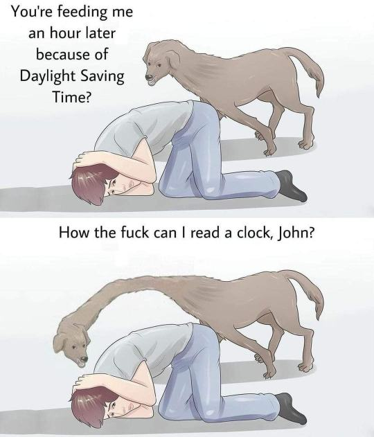


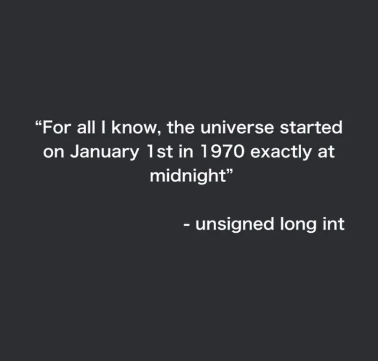

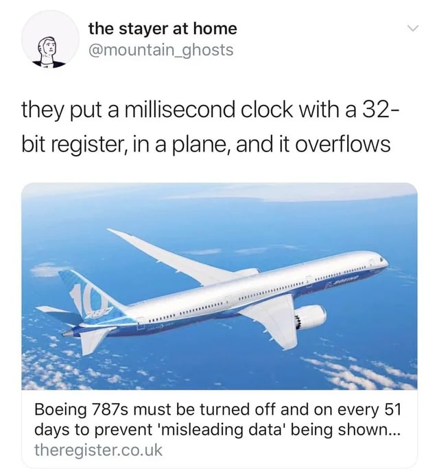

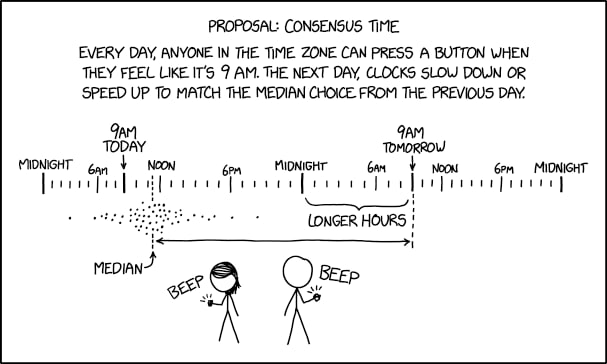

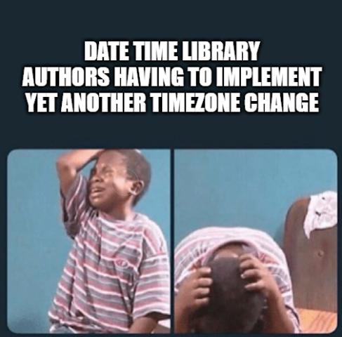


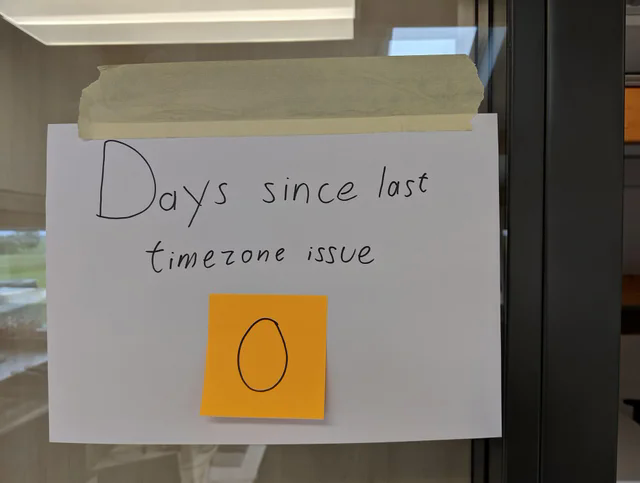

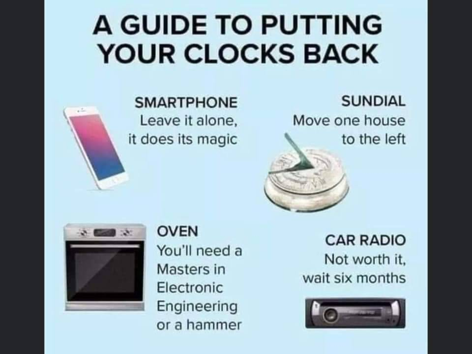

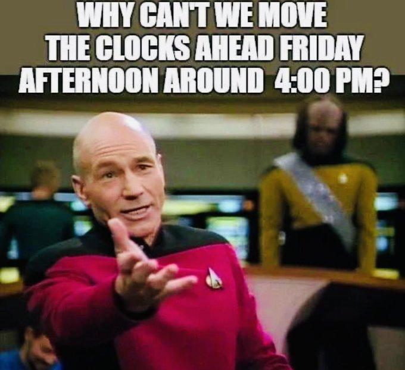

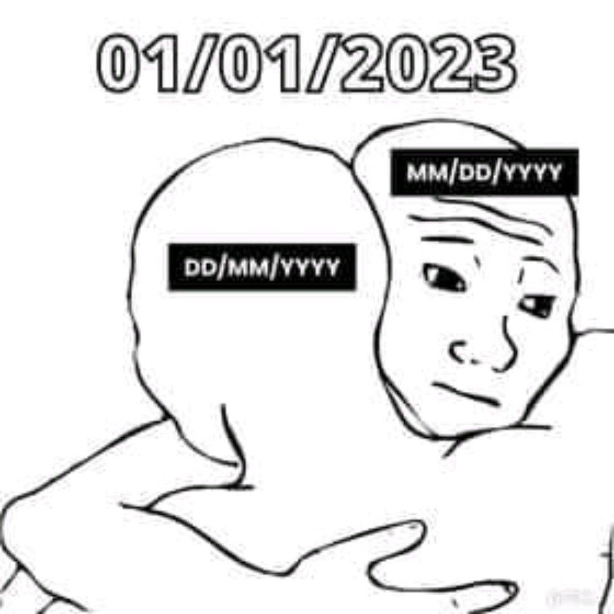

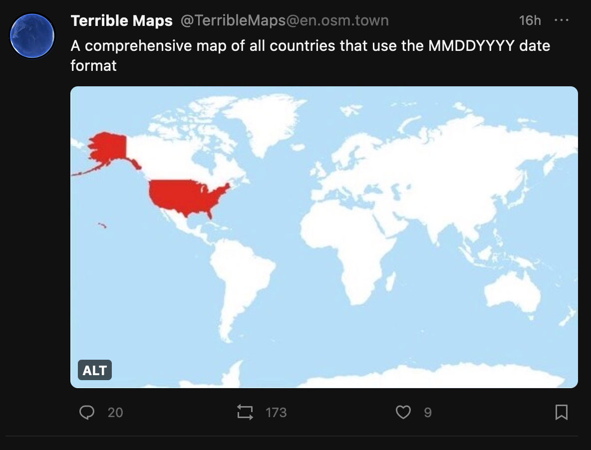

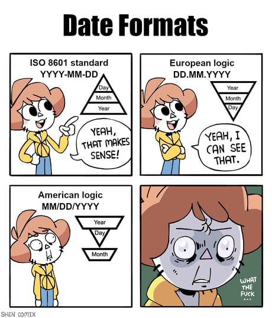

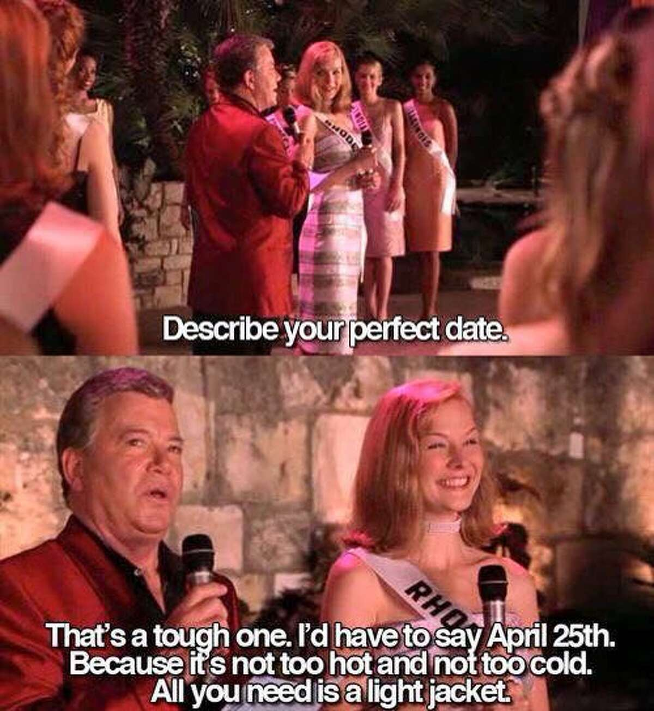

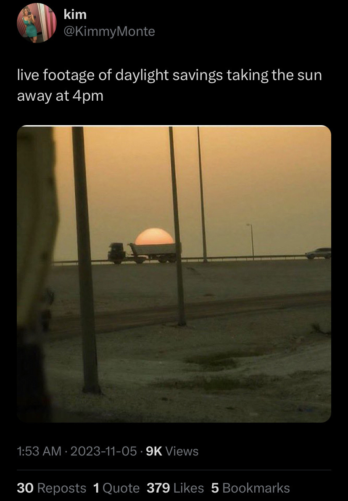

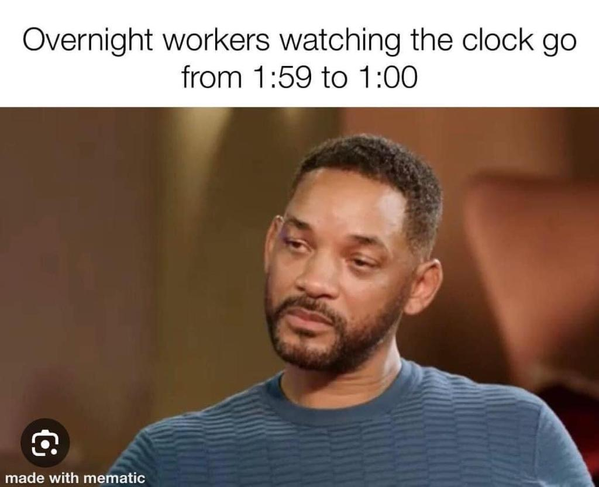


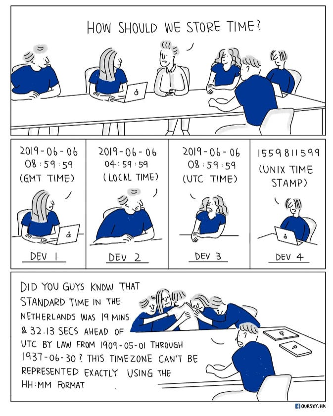

[^tz]: assumendo che lo stesso fuso orario sia usato ovunque
