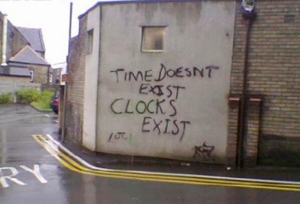
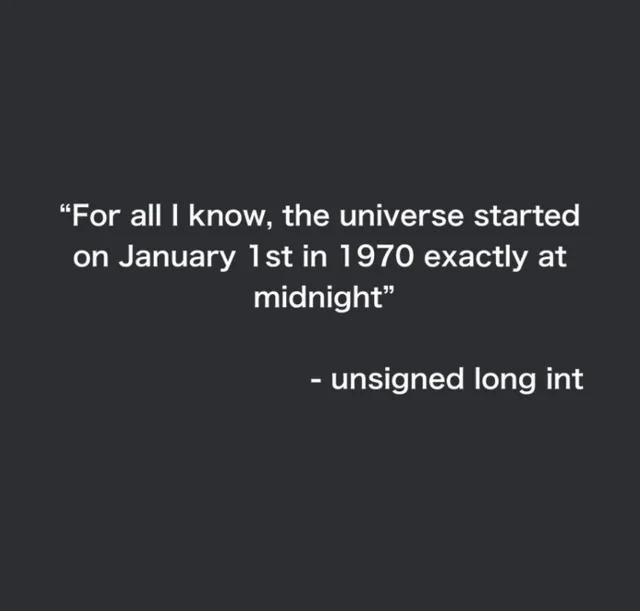
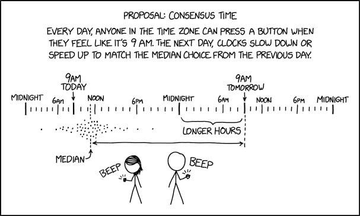
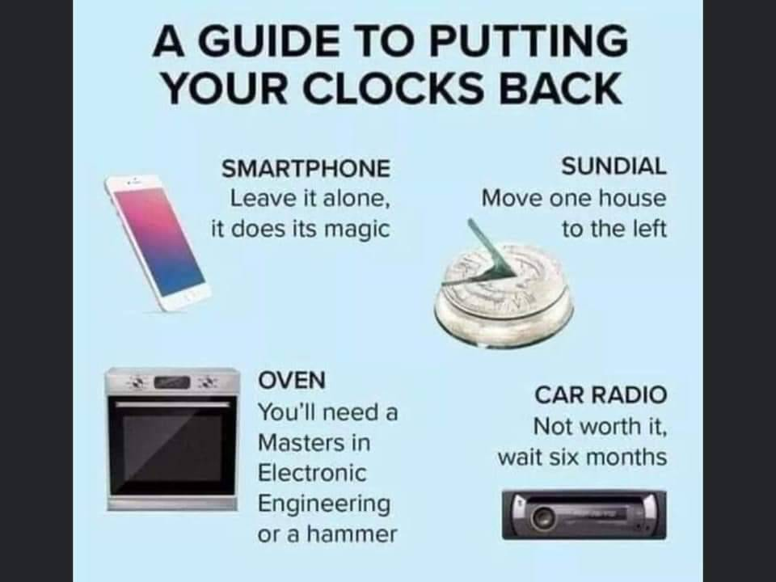
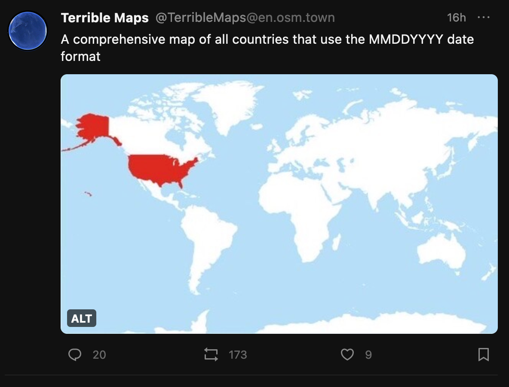

---
title:
  "An Introduction to Time Representation, Serialization and Management in
  Software"
date: 2013-04-15T14:19:00Z
toc: true
tags:
  - time
  - software development
pdf: true
---

Most issues in software development usually arise from poor, inconsistent
knowledge of the domain at hand. A topic apparently as simple as time
representation, serialization and management can easily cause a number of
problems both to the neophyte and to the experienced programmer.

In this post, we'll see that there's no need to be a
[Time Lord](http://en.wikipedia.org/wiki/Time_Lord) to grasp the very simple few
concepts needed not to incur into time management hell.



## Representation

A question as simple as _"What time is it?"_ assumes a number of contextual
subleties that are obvious to the human brain, but become absolute nonsense for
a computer.

For instance, if you were asking me what time is it right now, I might say:
_"It's 3:39"_ and, if you were a colleague in my office, that'd be enough
information to infer that it's 3:39pm CEST. That's because you would already be
in possession of some bits of important contextual information such as

- it's an afternoon because we've already had lunch
- we're in Rome, therefore our timezone is Central European Time (CET) or
  Central European Summer Time (CEST)
- we've switched to daylight savings time a few weeks earlier, so the current
  timezone must be Central European Summer Time

_3:39_ only happens to be a convenient representation of time as long as we're
in possession of the contextual bits. In order to represent time in a universal
way, you should have an idea what
[UTC](http://en.wikipedia.org/wiki/Coordinated_Universal_Time) and
[timezones](http://en.wikipedia.org/wiki/Time_zone) are.

Please do not confuse UTC with GMT: although their time matches, they are _two
different things_: one is an universal standard while the other is a timezone.
When someone says they're using GMT, unless that person has a funny scottish
accent, what they really mean is UTC.

As an amateur radio operator, I have contacts with people from all over the
world. Every operator is required to keep a log of his contacts, and we usually
exchange so called QSL cards, which are a written confirmation of the contact.
Of course a QSL card must report the exact time of the radio contact and by
convention it's in UTC. I know that when I receive a QSL card from any fellow
amateur radio operator, no matter where he is located across the whole wide
world, I can look up the contact in my logbook and the date and time info is
going to match, as we are both adhering to the same standard: UTC.

Now, suppose I have to schedule a Skype chat with a fellow software developer in
the US. I could write him an email and say something along the lines of _"see
you on 2/3"_. In Italy, that would be the second day in the month of march, but
to a US person, that would be the third day in the month of february. As you can
see, our chat is never going to happen.

These are only a few examples of the kind of issues that might arise when
representing date and time information. Luckily enough, there is a solution to
the representation conundrums, namely the
[ISO 8601](http://en.wikipedia.org/wiki/ISO_8601) standard or, better yet
[RFC 3339](https://www.rfc-editor.org/rfc/rfc3339).

Just to give you an example, in RFC 3339, `1994-11-05T08:15:30-05:00`
corresponds to November 5, 1994, 8:15:30 am, US Eastern Standard Time.
`1994-11-05T13:15:30Z` corresponds to the same instant (the `Z` stands for UTC).
Same instant, different representations.

RFC 3339 also has the nice side effect of providing natural sorting in systems
that use lexicographical order (such as filesystems) because information is
organized from most to least significant, i.e. year, month, day, hour, minute,
second, fraction of a second[^tz].

Even if you're only dealing with local times in your software, you should know
that, unless you also display the time zone, you can never be sure of the time.
I cannot remember how many times a developer has asked me to _fix the time_ on
the server, only to discover that his software was printing time in UTC.

At display time, it is okay to deal with partial representation of time because
the user experience requires so. Just make sure, when debugging, to print out
the whole set of information, including the time zone, otherwise you can never
be sure what you're looking at is what you actually think it is.

Although a given moment in time is immutable, there is an arbitrary number of
ways to express it. And we've not even talked about the Julian or Indian
calendars or stuff like expressing durations!

Let me summarize a few key points to bring home so far:

- get to know [time zones](http://en.wikipedia.org/wiki/Time_zone) and
  [UTC](http://en.wikipedia.org/wiki/Coordinated_Universal_Time)
- do not confuse UTC and GMT
- [RFC 3339](https://www.rfc-editor.org/rfc/rfc3339) and
  [ISO 8601](http://en.wikipedia.org/wiki/ISO_8601) are your friends
- always print the time zone while debugging


## Serialization

Speaking of software, serialization is a process where you take an object's
status and spell it out in such a way that it can be later entirely rebuilt,
exactly like the original, by using the spelt out (serialized) information.
Think of a xml or json file:

```json
{
  "person": {
    "name": "Mirko",
    "surname": "Caserta",
    "class": "nerd"
  }
}
```

This is the serialized form of a peculiar imaginary person class instance.

In the binary world of computers, time is usually serialized and stored by using
the [Unix time](http://en.wikipedia.org/wiki/Unix_time) convention. As I'm
writing this, my Unix time is `1366191727`. That is: `1366191727` seconds have
passed since January 1st, 1970 at 00:00 UTC. Isn't that a pretty clever,
consistent and compact way of representing a plethora of information, such as
`April 17 2013 @ 11:42:07am CEST`?

Unix time is only another arbitrary representation of a given moment in time,
although a not very human-readable one. But you can take that number, write it
on a piece of paper, stick it onto a carrier pigeon, and your recipient would be
able to decipher your vital message by simply turning to the Internet and
visiting a site such as [unixtimestamp.com](http://www.unixtimestamp.com/) or
[currentmillis.com](https://currentmillis.com/).

If you're a command line junkie like me, on Linux systems you can use:

```bash
$ date -d @1366191727
Wed Apr 17 11:42:07 CEST 2013
```

However, on BSD derived systems such as Mac OS X, date -d won’t work so you have
to used instead:

```bash
$ date -r 1366191727
Wed Apr 17 11:42:07 CEST 2013
```

Just like you can write that number on a piece of paper and later get back the
full instant back to life, you can store it in a file or a row in your favorite
RDBMS. Although you might want to talk to your RDBMS using a proper driver and
handing it a plain date instance; your driver will then take care of the
conversion to the underlying database serialization format for native time
instances.

By storing time using a native format, you get the nice time formatting,
sorting, querying, etc features of your RDBMS for free, so you might want to
think twice before storing plain Unix timestamps in, say, Oracle.

Just make sure you know what timezone your Unix timestamp refers to, or you
might get confused later at deserialization time. By default, a Unix timestamp
is in UTC. If you use your system's libraries, you should be okay.

When working with databases, use the most appropriate data types. For instance
in Oracle, there's
[four different data types](https://www.infobloom.com/why-does-china-have-only-one-time-zone.htm):
`DATE`, `TIMESTAMP`, `TIMESTAMP WITH TIME ZONE` and
`TIMESTAMP WITH LOCAL TIME ZONE`. Also, databases usually have a concept of
database timezone and session timezone, so make sure you understand how your
specific database is using those. A user that opens a session with timezone `A`
is going to see different values than a user connecting with timezone `B`.

ISO 8601 is also a serialization favorite. In fact, it is used in the
[XML Schema](http://www.w3.org/TR/xmlschema-2/#isoformats) standard. Most xml
frameworks are natively able to serialize and deserialize back and forth from
`xs:date`, `xs:time` and `xs:dateTime` to your programming language's native
format (and viceversa). The same is true for json. Just be careful when dealing
with partial representations: for instance, if you omit the time zone, make sure
you agree beforehand on a default one with your communicating party (usually UTC
or your local time zone if you're both in the same one).

## Management

First of all, if you think you can write your own time management software
library, or even write a little routine that adds or subtracts arbitrary values
from the time of the day, please allow me to show you the source code for the
[java.util.Date](https://github.com/openjdk/jdk17u/blob/master/src/java.base/share/classes/java/util/Date.java)
and
[java.util.GregorianCalendar](https://github.com/openjdk/jdk17u/blob/master/src/java.base/share/classes/java/util/GregorianCalendar.java)
classes from JDK 7, respectively weighting 1331 and 3179 lines of code.

Okay, these are probably not the best examples of software routines that deal
with time, I agree. That's why Java libraries like
[Joda Time](http://joda-time.sourceforge.net/) were written. In fact, Joda Time
has become so popular that it gave birth to
[JSR-310](http://jcp.org/en/jsr/detail?id=310) and is
[now](http://www.h-online.com/open/news/item/JSR-310-s-Date-and-Time-API-added-to-JDK-8-1708647.html)
[part](http://www.infoq.com/news/2013/02/java-time-api-jdk-8) of JDK 8.

Use of popular, well-designed and implemented time frameworks will save your
life. Seriously. Take your time to get familiar with the API of your choosing.

## Common Time Tasks in Java

Let's see how all this translates into java code. Any language will of course be
different but everything I'm doing here should be possible in your language of
choice.

Please do not use `java.util.Date` or `java.util.Calendar`. We don't use that
classes anymore. The new time api is in the `java.time` package.

```java
import java.time.*;
import java.time.format.DateTimeFormatter;
import java.time.format.FormatStyle;

class Main {
  public static void main(String[] args) {
    ZoneId systemDefault = ZoneId.systemDefault();
    System.out.println("systemDefault = " + systemDefault);

    long now = System.currentTimeMillis();
    System.out.println("now = " + now);

    LocalDate localDate = LocalDate.now();
    System.out.println("localDate = " + localDate);

    LocalDateTime localDateTime = LocalDateTime.now();
    System.out.println("localDateTime = " + localDateTime);

    LocalDateTime utc = LocalDateTime.now(ZoneId.of("UTC"));
    System.out.println("utc = " + utc);

    ZonedDateTime zonedDateTime1 = ZonedDateTime.now();
    System.out.println("zonedDateTime1 = " + zonedDateTime1);

    ZonedDateTime zonedDateTime2 = ZonedDateTime.now(ZoneId.of("UTC"));
    System.out.println("zonedDateTime2 = " + zonedDateTime2);

    String iso8601 = zonedDateTime2.format(DateTimeFormatter.ISO_INSTANT);
    System.out.println("iso8601 = " + iso8601);

    ZonedDateTime zonedDateTime3 = zonedDateTime2.plus(Duration.ofDays(7));
    System.out.println("zonedDateTime3 = " + zonedDateTime3);

    Instant nowAsInstant = Instant.ofEpochMilli(now);
    System.out.println("nowAsInstant = " + nowAsInstant);

    ZonedDateTime nowAsInstantInRome = nowAsInstant.atZone(ZoneId.of("Europe/Rome"));
    System.out.println("nowAsInstantInRome = " + nowAsInstantInRome);

    LocalDateTime romeLocalTime = nowAsInstantInRome.toLocalDateTime();
    System.out.println("romeLocalTime = " + romeLocalTime);

    LocalDate localDateInRome = nowAsInstantInRome.toLocalDate();
    System.out.println("localDateInRome = " + localDateInRome);

    LocalTime localTimeInRome = nowAsInstantInRome.toLocalTime();
    System.out.println("localTimeInRome = " + localTimeInRome);

    String shortTimeInRome = nowAsInstantInRome.format(DateTimeFormatter.ofLocalizedTime(FormatStyle.SHORT));
    System.out.println("shortTimeInRome = " + shortTimeInRome);

    String evenShorterTimeInRome = nowAsInstantInRome.format(DateTimeFormatter.ofPattern("HH:mm"));
    System.out.println("evenShorterTimeInRome = " + evenShorterTimeInRome);
  }
}
```

If you run this code with `java Main.java`, you should see something like this:

```bash
systemDefault = Europe/Rome
now = 1753718631998
localDate = 2025-07-28
localDateTime = 2025-07-28T10:03:51.999991
utc = 2025-07-28T16:03:52.000089
zonedDateTime1 = 2025-07-28T10:03:52.000532-06:00[Europe/Rome]
zonedDateTime2 = 2025-07-28T16:03:52.000620Z[UTC]
iso8601 = 2025-07-28T16:03:52.000620Z
zonedDateTime3 = 2025-08-04T16:03:52.000620Z[UTC]
nowAsInstant = 2025-07-28T16:03:51.998Z
nowAsInstantInRome = 2025-07-28T18:03:51.998+02:00[Europe/Rome]
romeLocalTime = 2025-07-28T18:03:51.998
localDateInRome = 2025-07-28
localTimeInRome = 18:03:51.998
shortTimeInRome = 6:03PM
evenShorterTimeInRome = 18:03
```

## Testing

In Java there's a `Clock` class that allows plugging in an arbitrarily
configurable clock implementation for use in the time api. This is especially
useful in unit testing and debugging. Other languages should have an equivalent
functionality.

<https://docs.oracle.com/javase/8/docs/api/java/time/Clock.html>

## Further Resources

Here are a few useful links I've accumulated over time:

- [How to Think About Time in Programming](https://shanrauf.com/archive/how-to-think-about-time-in-programming)
- [UTC is enough for everyone... right?](https://zachholman.com/talk/utc-is-enough-for-everyone-right)
- [The Problem with Time & Timezones - Computerphile](https://youtu.be/-5wpm-gesOY)
- [Falsehoods programmers believe about time](https://gist.github.com/timvisee/fcda9bbdff88d45cc9061606b4b923ca)
- [Storing UTC is not a silver bullet](https://codeblog.jonskeet.uk/2019/03/27/storing-utc-is-not-a-silver-bullet/)
- [The 5 laws of API dates and times](http://apiux.com/2013/03/20/5-laws-api-dates-and-times/)
- [Storing Date/Times in Databases](http://derickrethans.nl/storing-date-time-in-database.html)
- [5 Levels of Handling Date and Time in Python](https://medium.com/techtofreedom/5-levels-of-handling-date-and-time-in-python-46b601e47f65)
- [Timezone Bullshit](https://blog.wesleyac.com/posts/timezone-bullshit)
- [ISO 8601: the better date format](https://kirby.kevinson.org/blog/iso-8601-the-better-date-format/)
- [A summary of the international standard date and time notation](https://www.cl.cam.ac.uk/~mgk25/iso-time.html)
- [A Short History of the Modern Calendar](http://youtu.be/kzprsR2SvrQ)
- [Should We 'Heed the Science and Abolish Daylight Saving Time'?](https://yro.slashdot.org/story/21/03/14/014233/should-we-heed-the-science-and-abolish-daylight-saving-time)
- [When a Calendar Defeated Russia in the 1908 Olympics](https://www.si.com/extra-mustard/2013/12/30/the-extra-mustard-trivia-hour-when-a-calendar-defeated-russia-in-the-1908-olympics)
- [Why does China Have Only One Time Zone?](https://www.infobloom.com/why-does-china-have-only-one-time-zone.htm)
- [First day meme](https://www.reddit.com/r/ProgrammerHumor/comments/l99ip9/or_is_it_0th/)
- [Glory to ISO8601 Subreddit](https://www.reddit.com/r/ISO8601/)
- [Time.is](https://time.is/)
- [How Ancient Romans Kept Time](https://www.amusingplanet.com/2021/05/how-ancient-romans-kept-time.html)
- [rtc: rk808: Compensate for Rockchip calendar deviation on November 31st](https://git.kernel.org/pub/scm/linux/kernel/git/torvalds/linux.git/commit/?id=f076ef44a44d02ed91543f820c14c2c7dff53716)
- [Daylight saving time is 'not helpful' and has 'no upsides' experts say](https://eu.usatoday.com/story/news/health/2021/11/01/fall-back-daylight-saving-time-health-experts-want-you-know/6174156001/)
- [Neil deGrasse Tyson Reminds Us Daylight Saving Time is Ridiculous](https://youtu.be/j8VcpmpN0NM)
- [A "Day" Isn't What It Used To Be](https://youtu.be/DHIQxVhruak)
- [Why Time Zones Exist](https://youtu.be/qjUT7FbmNZ8)
- [xkcd: Dailight Calendar](https://xkcd.com/2542/)
- [xkcd: Edge Cake](https://xkcd.com/2549/)
- [How does Britain know what time it is?](https://youtu.be/yqciKS_N0K8)
- [Clockwork raises $21M to keep server clocks in sync](https://techcrunch.com/2022/03/16/clockwork-raises-21m-to-keep-server-clocks-in-sync/)
- [How to Fix Daylight Saving Time](https://youtu.be/39wAtJwFrVY)
- [US Senate Unanimously Passes Bill to Make Daylight Saving Time Permanent](https://www.reddit.com/r/sysadmin/comments/tez7ra/us_senate_unanimously_passes_bill_to_make/)
- [The Daily WTF: Starting your Date](https://thedailywtf.com/articles/starting-your-date)
- [Tech Giants Want To Banish the Leap Second To Stop Internet Crashes](https://www.cnet.com/tech/computing/tech-giants-try-banishing-the-leap-second-to-stop-internet-crashes/)
- [Meta calls for the death of the leap second](https://www.engadget.com/meta-death-of-the-leap-second-103545749.html)
- [Satellites Keep the World’s Clocks on Time. What if They Fail?](https://www.wired.com/story/satellite-time-distribution/)
- [Stop using utcnow and utcfromtimestamp](https://blog.ganssle.io/articles/2019/11/utcnow.html)
- [Dall'ora legale all'ora solare: i pro e contro del cambio orario e perché si parla di abolizione](https://youtu.be/Fu6AT5WLgJg)
- [Deer-vehicle collisions spike when daylight saving time ends](https://www.sciencenews.org/article/deer-vehicle-collisions-daylight-saving-time)
- [The Falling Dates](https://thedailywtf.com/articles/the-falling-dates)
- [Scientists Don’t Want to Count Leap Seconds, so They’re Going Away](https://www.howtogeek.com/850114/scientists-don%E2%80%99t-want-to-count-leap-seconds-so-they%E2%80%99re-going-away/)
- [What time is it on the Moon?](https://www.nature.com/articles/d41586-023-00185-z)
- [What time is it on the moon? Europe pushing for lunar time zone](https://www.cbc.ca/news/science/moon-time-zone-1.6763962)
- [What time is it? A simple question with a complex answer. How computers synchronize time](https://andrea.corbellini.name/2023/01/23/what-time-is-it/)
- [The Daylight Saving Time Mess Just Won't Go Away](https://www.wired.com/story/2023-daylight-saving-time/)
- [The best way to handle time zones in a Java web application](https://vladmihalcea.com/time-zones-java-web-application/)
- [Your Calendrical Fallacy Is...](https://yourcalendricalfallacyis.com/)
- [Greenland Solves the Daylight Saving Time Debate](https://www.bnnbloomberg.ca/greenland-solves-the-daylight-saving-time-debate-1.1900228)
- [Time Zone and Currency Database in JDK](https://foojay.io/today/time-zone-and-currency-database-in-jdk/)
- [(There Ought To Be A) Moonlight Saving Time](https://youtu.be/Zpiou9Rn8UE)
- [We don’t do DST at this company](https://blog.backslasher.net/no-dst.html)
- [Daylight Savings Time be like](https://www.instagram.com/p/CzPDoZcuV-b/)
- [List of 2024 leap day bugs](https://codeofmatt.com/list-of-2024-leap-day-bugs/)
- [California State Legislator Proposes Ending DST](https://yro.slashdot.org/story/24/03/09/2311200/california-state-legislator-proposes-ending-daylight-saving-time)
- [The science behind why people hate Daylight Saving Time so much](https://arstechnica.com/features/2024/03/the-science-behind-why-people-hate-daylight-savings-time-so-much/)
- [Storing UTC is not a silver bullet](https://codeblog.jonskeet.uk/2019/03/27/storing-utc-is-not-a-silver-bullet/)
- [JS Dates Are About to Be Fixed](https://docs.timetime.in/blog/js-dates-finally-fixed/)
- [Researchers Figure Out How To Keep Clocks On the Earth, Moon In Sync 13](https://science.slashdot.org/story/24/08/15/0145200/researchers-figure-out-how-to-keep-clocks-on-the-earth-moon-in-sync)
- [NASA confirms it’s developing the Moon’s new time zone](https://www.engadget.com/science/space/nasa-confirms-its-developing-the-moons-new-time-zone-165345568.html)
- [Storing time for human events](https://simonwillison.net/2024/Nov/27/storing-times-for-human-events/)
- [Date and Time Mappings with Hibernate and JPA](https://thorben-janssen.com/hibernate-jpa-date-and-time/)
- [I Found the Dumbest Time Zone](https://youtu.be/Lz3jAEdzbbA)
- [A Server for Matching Long/Lat to Timezone](https://github.com/LittleGreenViper/LGV_TZ_Lookup)
- [Ianto Cannon's clock graphics](https://ianto-cannon.github.io/clock.html)
- [AlphaDec, a timezone-agonistic time format for humans, machines, and AI](https://github.com/firasd/alphadec)
- [RFC 3339 vs ISO 8601](https://ijmacd.github.io/rfc3339-iso8601/)
- [How the tz database works](https://yatsushi.com/blog/tz-database/)
- [A literary appreciation of the Olson/Zoneinfo/tz database](https://blog.jonudell.net/2009/10/23/a-literary-appreciation-of-the-olsonzoneinfotz-database/)
- [Benjamin Franklin's Essay on Daylight Saving](https://www.webexhibits.org/daylightsaving/franklin3.html)
- [How England Colonized Time](https://youtu.be/mkVxJVgO1QY)
- [Cheatsheet & Examples: date](https://tech.mrleong.net/cheatsheet-examples-date)

## Memes














[^tz]: assuming the same timezone is used everywhere
